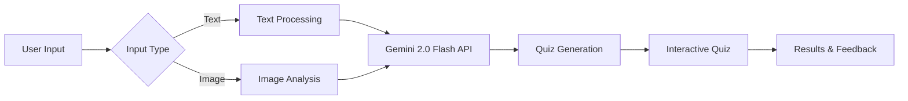

<div align="center">

# 🧠 QuizGenius


**Transform any text or image into an engaging quiz experience with AI**

[✨ Features](#-features) • [🚀 Getting Started](#-getting-started) • [📱 Screenshots](#-screenshots) • [🛠️ How It Works](#%EF%B8%8F-how-it-works) • [🔮 Future Plans](#-future-plans)

</div>

---

## ✨ Features

<div align="center">
<table>
  <tr>
    <td align="center"><h3>📝</h3>Text Input</td>
    <td align="center"><h3>🖼️</h3>Image Upload</td>
    <td align="center"><h3>🎯</h3>Customizable</td>
  </tr>
  <tr>
    <td>Generate quizzes from articles, notes, or any text content</td>
    <td>Create quizzes from images with advanced visual recognition</td>
    <td>Adjust difficulty and question count to match your needs</td>
  </tr>
  <tr>
    <td align="center"><h3>📊</h3>Score Tracking</td>
    <td align="center"><h3>🎨</h3>Beautiful UI</td>
    <td align="center"><h3>📱</h3>Responsive</td>
  </tr>
  <tr>
    <td>Monitor your progress with detailed scoring and feedback</td>
    <td>Enjoy a modern, intuitive interface with smooth animations</td>
    <td>Works perfectly on all devices - desktop, tablet, and mobile</td>
  </tr>
</table>
</div>

## 🚀 Getting Started

### Prerequisites

- A modern web browser (Chrome, Firefox, Safari, Edge)
- Internet connection to access the Gemini API

### Quick Start

1. Visit [QuizGenius](https://capstone1-delta.vercel.app/) or run locally
2. Choose your input method (text or image)
3. Set your desired quiz options
4. Click "Generate Quiz" to create your personalized quiz

### Running Locally

```bash
# Clone the repository
git clone https://github.com/SouryaParnSid/capstone1.git

# Navigate to the project directory
cd capstone1

# Open in your browser
# Simply open index.html in your browser or use a local server
python -m http.server 8000
```

## 📱 Screenshots

<div align="center">

| Home Screen | Quiz Generation | Quiz Taking |
|:---:|:---:|:---:|
|  |  |  |

</div>

## 🛠️ How It Works

<div align="center">



</div>

QuizGenius leverages Google's powerful Gemini 2.0 Flash model to analyze your content and generate relevant, challenging questions. The application processes your input (whether text or image), sends it to the Gemini API with specific prompting to create well-structured quiz questions, and presents them in an engaging interactive format.

## 🧩 Use Cases

- **Students**: Create practice quizzes from lecture notes or textbook chapters
- **Teachers**: Generate assessments from educational materials
- **Content Creators**: Test audience knowledge on your content
- **Curious Minds**: Learn about any subject through interactive quizzing
- **Visual Learners**: Generate questions about diagrams, charts, or photographs

## 🔮 Future Plans

- **Multiple Quiz Formats**: Support for true/false, fill-in-the-blank, and matching questions
- **Quiz Sharing**: Share your generated quizzes with friends or colleagues
- **User Accounts**: Save your quiz history and track improvement over time
- **Advanced Analytics**: Get insights into your knowledge strengths and weaknesses
- **Offline Mode**: Generate and take quizzes without an internet connection

## 🔧 Technologies Used

<div align="center">


</div>

## 📜 License

This project is licensed under the MIT License - see the LICENSE file for details.

## 🙏 Acknowledgments

- Powered by Google's Gemini 2.0 Flash AI
- Icons by Font Awesome
- Fonts by Google Fonts

---

<div align="center">

**Created with ❤️ by Sourya Sarkar**

<a href="https://github.com/SouryaParnSid"></a>

</div>
